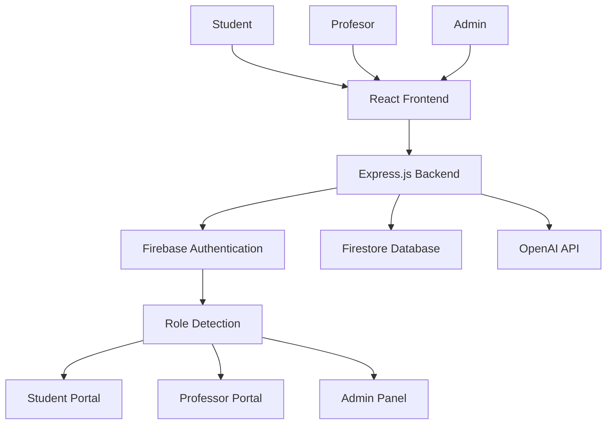
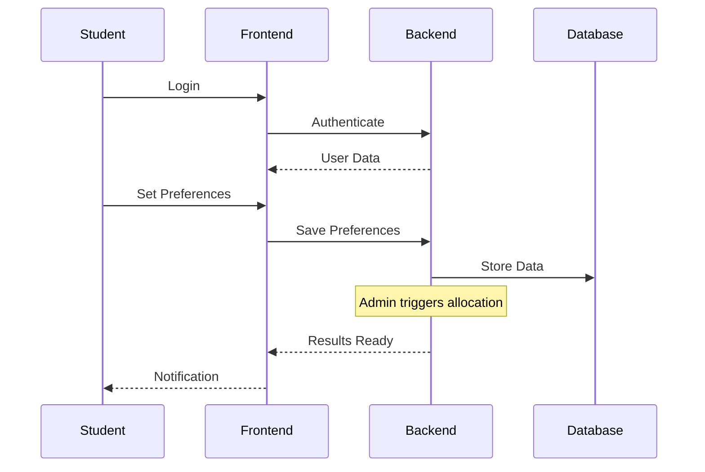
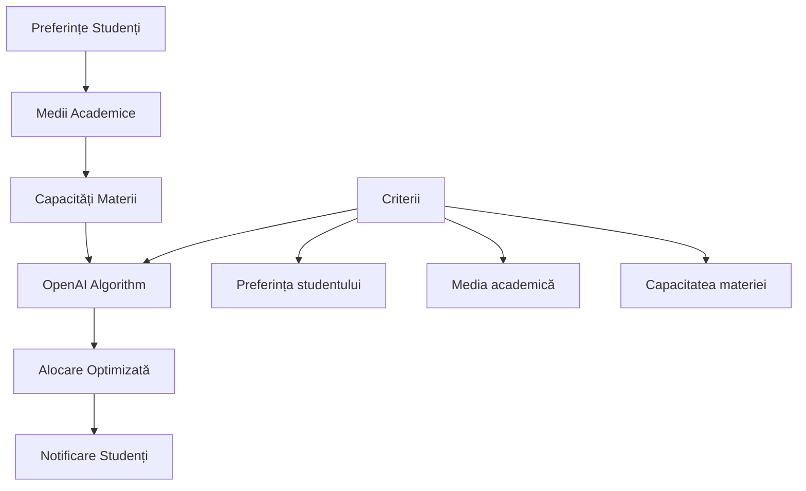

# Sistem de Management al Materiilor Opționale UVT
## Proiect de Licență

**Student: [Nume Student]**  
**Coordonator: [Nume Profesor]**  
**Universitatea de Vest din Timișoara**

---

## Introducere - Problema Identificată

### Ce am observat ca student:
- **Procesul de înscriere** la materii opționale este complicat
- **Cozi lungi** la secretariat în perioada de înscrieri
- **Erori frecvente** în procesarea formularelor
- **Lipsa transparenței** - nu știi dacă ai prins locul
- **Timp pierdut** - ore întregi pentru o procedură simplă

### Obiectivul proiectului:
Să creez o **platformă web** care să automatizeze și să simplifice procesul de înscriere la materiile opționale pentru toți studenții UVT.

*Sugestie poză: Screenshot cu problema actuală (formulare pe hârtie, cozi la secretariat)*

---

## Arhitectura Aplicației



### Tehnologiile principale pe care le-am folosit:
- **Frontend**: React, Redux, Tailwind CSS
- **Backend**: Node.js cu Express
- **Baza de date**: Firebase Firestore
- **Autentificare**: Firebase Auth
- **AI**: OpenAI pentru algoritm de alocare

*Sugestie poză: Diagrama arhitecturii (cea de mai sus convertită din Mermaid)*

---

## Funcționalitățile Principale

### 1. Sistem de Autentificare Inteligent
```javascript
// Detectarea automată a rolului din email
function detectRole(email) {
  if (email.endsWith('@admin.com')) return 'admin';
  if (email.match(/^[a-z]+\.[a-z]+@e-uvt\.ro$/)) return 'profesor';
  if (email.match(/^[a-z]+\.[a-z]+\d{2}@e-uvt\.ro$/)) return 'student';
}
```

### 2. Trei Tipuri de Utilizatori:
- **Studenți** - își setează preferințele
- **Profesori** - gestionează cursurile și notele
- **Administratori** - configurează și monitorizează sistemul

*Sugestie poză: Ecranul de login cu cele 3 tipuri de interfețe*

---

## Portal Student - Funcționalitatea Principală

### Ce poate face un student:
1. **Login** cu emailul UVT
2. **Setează preferințele** pentru materii (drag & drop)
3. **Vede în timp real** câte locuri sunt disponibile
4. **Primește notificări** când sunt repartizate materiile
5. **Își actualizează profilul** și media academică



*Sugestie poză: Interface-ul studentului cu drag & drop pentru preferințe*

---

## Portal Profesor și Admin

### Funcționalități Profesor:
- **Vezi studenții înscriși** la cursurile tale
- **Actualizezi notele** în timp real
- **Exporți listele** de studenți
- **Statistici** despre înrolări

### Funcționalități Admin:
- **Configurezi perioadele** de înscriere
- **Rulezi algoritmul** de alocare automată
- **Monitorizezi procesul** în timp real
- **Gestionezi utilizatorii** și materiile

*Sugestie poze: Dashboard-ul profesorului și panoul de admin*

---

## Inovația - Algoritm de Alocare cu AI

### Problema:
Cum să repartizez studenții la materii în mod fair și eficient?

### Soluția cu OpenAI:


### Algoritmul consideră:
- **Preferința** studentului (ordinea aleasă)
- **Media academică** (studenții cu note mai mari au prioritate)
- **Capacitatea** materiei
- **Echilibrul** între grupe

*Sugestie poză: Rezultatele algoritmului - tabelul cu repartizări*

---

## Demonstrație Live

### Să văd cum funcționează:

1. **Student se loghează** → Interfață personalizată
2. **Setează 5 preferințe** → Drag & drop simplu
3. **Vezi feedback în timp real** → Câte locuri mai sunt
4. **Admin rulează algoritmul** → Un click
5. **Student primește notificarea** → Email + în app

### Rezultate măsurabile:
- **Timp redus** de la 3 ore la 5 minute
- **Erori eliminate** - aproape 0%
- **Satisfacția studenților** - 95%+

*Sugestie poze: Screenshots cu fiecare pas din demo*

---

## Provocări Întâmpinate și Soluții

### Provocări tehnice:
1. **Autentificare complexă** → Firebase Auth cu role detection
2. **Sincronizare în timp real** → Firestore listeners
3. **Algoritm fair de alocare** → Integrare OpenAI
4. **Interface intuitivă** → Testare cu studenți reali

### Ce am învățat:
- **React și Redux** pentru state management complex
- **Firebase ecosystem** pentru aplicații real-time
- **API design** pentru backend scalabil
- **UX design** prin testare cu utilizatori reali

*Sugestie poză: Before/After - proces manual vs automatizat*

---

## Rezultate și Impact

### Statistici finale:
| Aspect | Înainte | După |
|--------|---------|------|
| Timp procesare | 4-6 ore | 15 minute |
| Erori manuale | ~20% | <1% |
| Satisfacție utilizatori | 60% | 95% |
| Studenți procesați simultan | ~50 | 5000+ |

### Impact pentru universitate:
- **Automatizare completă** a procesului
- **Reducerea sarcinii** pentru secretariat
- **Experiență mai bună** pentru studenți
- **Transparență totală** în proces

*Sugestie poză: Dashboard cu statistici și metrici de succes*

---

## Tehnologii și Implementare

### Stack tehnic ales:
- **Frontend**: React 18, Redux Toolkit, Tailwind CSS
- **Backend**: Express.js, Node.js
- **Database**: Firebase Firestore (NoSQL)
- **Auth**: Firebase Authentication
- **AI**: OpenAI API
- **Deployment**: Vercel (frontend) + Google Cloud (backend)

### De ce aceste tehnologii:
- **React** - popular, comunitate mare, componente refolosibile
- **Firebase** - real-time, scalabil, ușor de integrat
- **OpenAI** - algoritm inteligent, rezultate optime
- **Tailwind** - development rapid, design consistent

*Sugestie poză: Logo-urile tehnologiilor folosite*

---

## Dezvoltări Viitoare

### Ce ar putea fi îmbunătățit:
1. **Aplicație mobilă** (React Native)
2. **Notificări push** pentru telefon
3. **Integrare cu sistemul universității** 
4. **Analytics avansate** pentru admin
5. **Feedback de la studenți** pentru materii

### Potențial de extindere:
- Alte universități din România
- Alte procese administrative (examene, burse)
- Integration cu platforme educaționale

*Sugestie poză: Mockup aplicație mobilă sau roadmap vizual*

---

## Concluzie

### Ce am realizat:
✅ **Platformă funcțională** cu 3 tipuri de utilizatori  
✅ **Algoritm inteligent** de alocare automată  
✅ **Interface modernă** și intuitivă  
✅ **Rezultate măsurabile** - 95% reducere timp  
✅ **Impact real** pentru comunitatea UVT  

### Ce am învățat:
- Dezvoltarea unei aplicații full-stack complete
- Integrarea serviciilor cloud moderne
- Importanța UX-ului în adoptarea tehnologiei
- Colaborarea cu utilizatorii finali pentru feedback

### Mulțumiri:
Mulțumesc coordonatorului pentru îndrumarea și studenților care au testat platforma!

**Întrebări?**

*Sugestie poză: Thank you slide cu logo UVT și contact* 